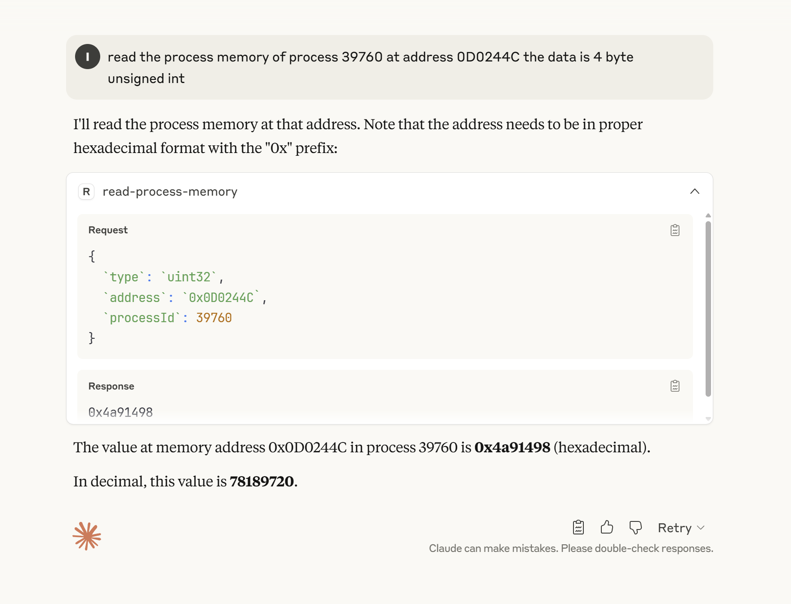

# mcp-read-process-memory

A mcp server for reading process memory on windows,
under the hood it uses windows `ReadProcessMemory` API



## Install

```shell

npm install -g mcp-read-process-memory

```

## Config MCP Host

Claude

```jsonc
{
  "mcpServers": {
    "mcp-read-process-memory": {
      "command": "node",
      "args": [
        // run npm root -g to check your node modules root
        "YOUR_ROOT\\mcp-read-process-memory\\build\\index.js",
      ],
    },
  },
}
```

## Credits

Inspired by https://github.com/mrexodia/ida-pro-mcp